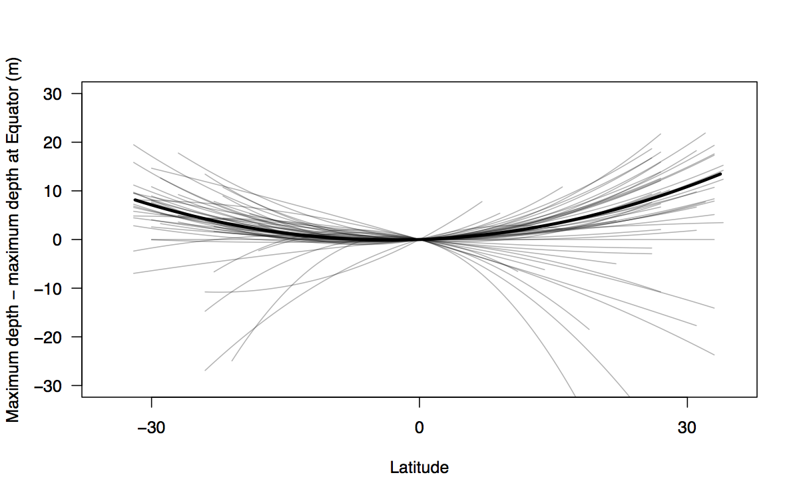

# Comment on "Limited scope for latitudinal extension of reef corals"

The data, analysis and figure for our comment on Muir et al. (2015) Science (http://www.sciencemag.org/content/348/6239/1135.abstract). The comment was rejected by Science based on Muir et al.'s response to it, and so we will submit the piece to Global Ecology and Biogeography.

The data files in the `data` folder are the files published by Muir et al. at Dryad (https://datadryad.org/resource/doi:10.5061/dryad.3b568).

The `analysis.r` file runs R code that loads the data files, re-analyses the data as described in the pre-print, and makes the figure in the `figs` folder.

Required R packages are `lqmm` and `quantreg`.

